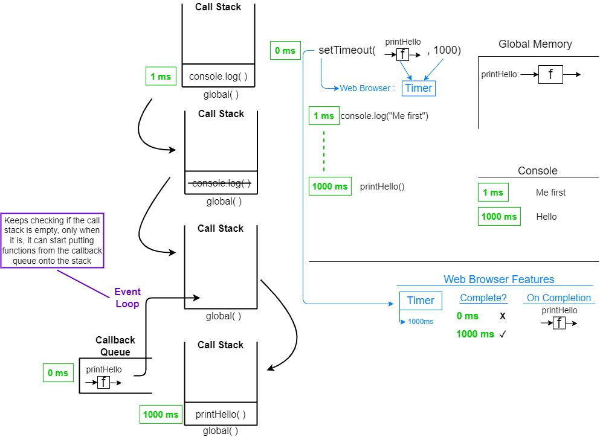
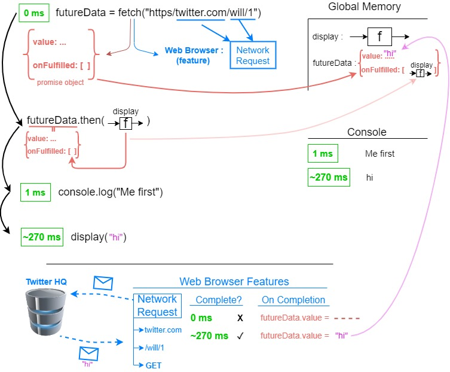
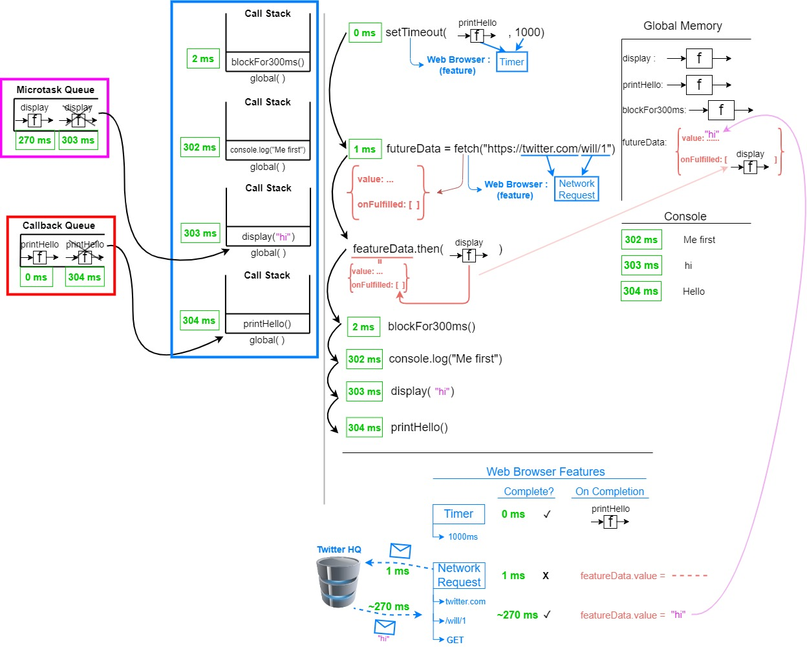
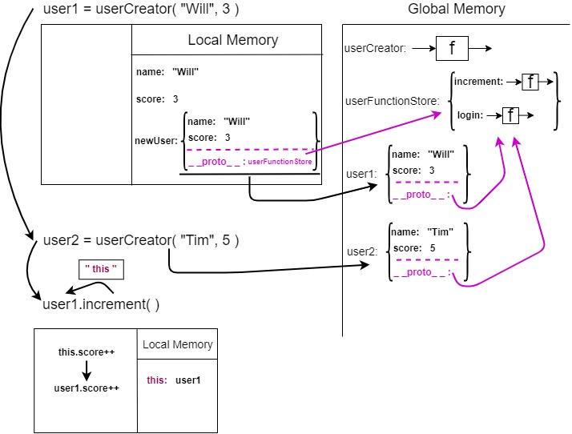
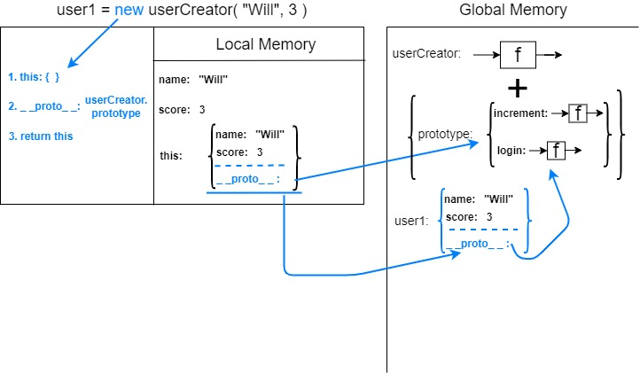

## These are my notes for the course JavaScript Hard Parts by Will Sentance. If you want any of this to make any sense, go whatch the course on frontendmasters.com.
<br>


<details>
<summary>Principles of JavaScript</summary>
<br>

# JavaScript Principles:

## When JavaScript code runs, it:
Goes through the code line-by-line and runs/executes each line -known as the **thread of execution**  

JavaScript has only **one thread of execution**

Saves "data" like strings and arrays so we can use that data later - in its **memory**

## Execution context
Created to run the code of a function - has 2 parts
- Thread of execution
- Memory

```javascript
const num = 3;
function multiplyBy2 (inputNumber) {
  const result = inputNumber*2;
  return result;
}

const output = multiplyBy2(num)
const newOutput = multiplyBy2(10);
```

### What happens under the hood when this code runs (JavaScript executes code line-by-line top down):
1. The *global* **Execution Context** is created (created for running the main program)
2. **[In global memory]** defining/saving a constant *num*, assigning value 3 to it
3. **[In global memory]** defining/saving the function *multiplyBy2*, the code inside the function will also be saved in memory
4. **[In global memory]** defining/saving a constant *output*, no value will be assigned to it for now (uninitialized)
5. *multiplyBy2* function will be executed, the argument passed into it will evaluate to value 3 - *multiplyBy2( 3 )*
6. A new **Execution Context** specifically for executing  *multiplyBy2* - it will also have memory, called *local memory* for storing local data
7. **[In local memory]** defining/saving the parameter *inputNumber*, assigning to it the argument passed into the function, that is 3
8. **[In local memory]** defining/saving the constant *result*, assigning to it the result of the expression *inputNumber\*2* which evaluates to 6
9. *multiplyBy2(num)* will return the value of the constant *result* which is 6, which means it will *evaluate* to 6 (*output = multiplyBy2(num) = multiplyBy2(3) = 6 <=> output = 6*)
10. **[In global memory]** the already defined constant *output* will get assigned a value of 6
11. **[In global memory]** defining/saving a constant *newOutput* no value will be assigned to it for now (uninitialized)
12. Step 5 will be repeated, and the function *multiplyBy2* will be called with the argument 10

## Call stack
JavaScript keeps track of what function is currently running (where's the thread of execution)  

Run a function -> add to call stack  

Finish running the function -> JS removes it from call stack  

Whatever is at the top of the call stack -> that's the function we're currently running


### What happens on the call stack when the code above runs:

``` 
Call stack
1. The global execution context is added at the bottom of the call stack, and that will be there until the whole program is executed, for our example we will call it "global()"

|                |  
|                |   
|                |  
|                |
------------------   
|     global()   |
------------------ 

2. When we encounter the call of the function multiplyBy2(num), a new execution context will be created and will be added onto the stack

|                |  
|                |   
|                |  
------------------
|multiplyBy2(num)|
------------------   
|     global()   |
------------------  

3. After multiplyBy2(num) executes and returns, its execution context will be popped off the stack

|                |  
|                |   
|                |  
|                |
------------------   
|     global()   |
------------------ 

4. Then we encounter the call of the function multiplyBy2(10), and again, a new execution context will be created and will be added onto the stack

|                |  
|                |   
|                |  
------------------
|multiplyBy2(10)|
------------------   
|     global()   |
------------------  

5. After multiplyBy2(10) executes and returns, its execution context will be popped off the stack

|                |  
|                |   
|                |  
|                |
------------------   
|     global()   |
------------------ 

6. When the program terminates, global() will also be popped off the stack
```
</details>

<details>
<summary>Functions and Callbacks</summary>
<br>

# Functions and Callbacks:

## Higher order functions
Any function that takes in a function as parameter and/or returns a function

## Callback functions
Any function that is **passed as an argument to another function**

It allows a function to call another function

A callback function can run after another function has finished

### Example code:
```javascript
// Higher order function
function copyArrayAndManipulate(array, instructions) {
  const output = [];
  for (let i = 0; i < array.length; i++) {
    output.push(instructions(array[i]))
  }
  return output;
}

// Callback 
function multiplyBy2(input) {
  return input * 2;
}

const result = copyArrayAndManipulate([1, 2, 3], multiplyBy2);
```

</details>

<details>
<summary>Closure</summary>
<br>

# Closure:

### Example of closure in JS
```javascript
// returns a function that takes as parameter "num"
// and returns the result of num * 2;
function createFunction() {
  function multiplyBy2 (num){
    return num * 2;
  }
  return multiplyBy2;
}

// generatedFunc now basically becomes multiplyBy2
// same functionality, different name
const generatedFunc = createFunction();

// the value stored into result will be num * 2 -> 3 * 2 -> 6
const  result = generatedFunc(3);

// IMPORTANT
// To find the actual code to execute in order to run generatedFunc(3), JavaScript will
// not look into createFunction which is stored in loacl memory but it will look into generatedFunc
// which is also stored in global memory
```
<br>

## Making our functions have "persistent memory"
<br>

```javascript
function outer() {
  let counter = 0; // will be found inside [[scope]] once the function returns
  function incrementCounter() {
    counter++;
  }
  return incrementCounter;
}

const myNewFunction = outer();
myNewFunction(); // counter == 1
myNewFunction(); // counter == 2
```

### So how does this work?
1. The function *outer* will be saved into global memory
2. Once we reach *const myNewFunction = outer()*, a constant called myNewFunction will be saved in memory, but the constant will not yet be initialized
3. The function called *outer* will be executed
4. It will return the function *incrementCounter* which will be saved into *myNewFunction* in global memory  

## Important:  
**The incrementCounter function that is returned in step 4. will have a hidden property called *\[\[scope\]\]***  
**In that *\[\[scope\]\]* property, all data that the *incrementCounter* function needs in order to run, and is inside the higher order function (in this case, the function *outer()*), will be present, and available for use whenever *incrementCounter* will be run**  

### That is how *myNewFunction()* can run successfully, and access the *counter* in order to increment it.
</details>

<details>
<summary>Asynchronous JavaScript</summary>
<br>

# Asynchronous JavaScript:

### Asynchronous JavaScript is not something that is built into the language itself, but is *called* from the language and provided by the browser.  

### Other examples of functionality provided by the browser that we *call* from JavaScript

| Javascript code  |  Browser feature | 
|---|---|
| console  | Console  |
| setTimeout  | Timer  |
| document  | HTML DOM  |
| xhr/fetch  | Network request  |
| localStorage  | Local storage  |

<br>

### Let's start from this example:  
```javascript
function printHello() {
  console.log("Hello);
}

setTimeout(printHello, 1000);

console.log("Me first!");
```
<br>

### Diagram of what happens when this code is executed  


</details>

<details>
<summary>Promises</summary>
<br>

# Promises:

### Let's start from this example:  
```javascript
function display(data) {
  console.log(data);
}

const futureData = fetch("https://twitter.com/will/tweets/1");
futureData.then(display);

console.log("Me first!");
```
<br>

### Diagram of what happens when this code is executed  


<br>

### Second example:  
```javascript
function display(data) {
  console.log(data);
}
function printHello() {
  console.log("Hello");
}
function blockFor300ms() {
  // blocks js thread for 300ms
}

setTimeout(printHello, 0);

const futureData = fetch("https://twitter.com/will/tweets/1");
futureData.then(display);

blockFor300ms();
console.log("Me first");
```

<br>

### Diagram of what happens when this code is executed  


### NOTE:
Any function that has a promise object attached, goes into the **Microtask Queue**  

Any other function that triggers a browser feature but does not have a promise object, goes into the **Callback Queue**
<br>

### IMPORTANT:
The promise object has another hidden property called **onRejection** which allows it to take in a function to be ran whenever an error occurs in the promise  
That function can be passed either in the **.catch()** or as the second parameter to **.then()**
<br>

The priority on the **Call Stack** is:
1. Synchronous functions (*go directly on the stack*)
2. Functions from the Microtask Queue
3. Function from the Callback Queue

The **Event Loop** is what *polls* the **Call Stack** to check if it's empty, and only when it is, it can add functions from the **Microtask Queue** then from **Callback Queue**
</details>

<details >
<summary>Classes & Prototypes</summary>
<br>

# Classes & Prototypes:

### How can we bundle up state and functionality in an way that is easy to reason about, easy to add features to and also efficient and performant?
<br>

### Would this be a solution?
```javascript
const user3 = Object.create(null);

user3.name = "Eva";
user3.score = 9;
user3.increment = function() {
  user3.score++;
};

```
Not really, this code will be getting repetitive when creating other users. It's breaking DRY principle.
<br>
<br>

## Solution 1. Generate objects using function
```javascript
function userCreator(name, score) {
  const newUser = {};
  newUser.name = name;
  newUser.score = score;
  newUser.increment = function() {
    newUser.score++;
  };
  return newUser;
};

const user1 = userCreator("Will", 3);
const user2 = userCreator("Tim", 5);
user1.increment()
```
**Problems:** Each time we create a new user we make space in our computer's
memory for all our data and functions. But our functions are just copies.  
**Benefits:**  It's simple and easy to reason about!
<br>
<br>

## Solution 2. Using the prototype chain
```javascript
function userCreator (name, score) {
  const newUser = Object.create(userFunctionStore);
  newUser.name = name;
  newUser.score = score;
  return newUser;
};

const userFunctionStore = {
  increment: function(){this.score++;},
  login: function(){console.log("Logged in");}
};

const user1 = userCreator("Will", 3);
const user2 = userCreator("Tim", 5);
user1.increment();
```
### How does this work?
We store the increment function in just one object and have the interpreter, if it
doesn't find that function on *user1*, look up to that object to check if it's there.  
In other words, we link *user1* and *functionStore* so the interpreter, on not finding **.increment** on *user1*, makes
sure to check up in *functionStore* where it would find it.
The link can be made with **Object.create()** technique.  

### Diagram of what happens when this code runs  


<br>

### But what if we add this line to our code?  
```javascript
user1.hasOwnProperty("score");
```
Does *user1* have this method? No it does not.  
Maybe it's on *userFunctionStore*? Nope.  
Then where is it and how come we can access it?  
The **prototypal** nature of JavaScript is what allows this to work, and it works like this:
1. The interpreter will go to *user1* looking for the method *hasOwnProperty* and it won't find it
2. Since *user1*'s **_ _proto\_ _** property links to *userFunctionStore*, the interpreter will go up the **prototype chain** and look there, but it won't find the method there either
3. But *userFunctionStore* also has a **_ _proto\_ _** property that links to **Object.prototype**, and on that object reside a number of useful *helper* methods, that all objects *inherit* and can use.
<br>
<br>

## The "new" keyword
### When we call the function that returns an object by using the *new* in front of it, we automate 2 things:
1. Create a new object (in our case, we create a new *user* object)
2. Return a new object (*user* object)

Based on what we've seen above in our *userCreator* function, we will basically be able to remove functionality that will be implemented automatically for us by the **new** keyword, and so the resulting code will be this:

```javascript
function userCreator (name, score) {
  // const newUser = Object.create(userFunctionStore); -- no longer needed

  // instead of userCreator.name = ...
  // we now use this.name
  this.name = name;
  this.score = score;

  // return newUser; -- no longer needed
};

// const userFunctionStore = {
//   increment: function(){this.score++;},
//   login: function(){console.log("Logged in");}
// }; -- no longer needed

// userFunctionStore can be replaced with
userCreator.prototype.increment = function() {
  this.score++;
}

// const user1 = userCreator("Will", 3); -- we call it with "new" now
const user2 = new userCreator("Will", 3);
```
### IMPORTANT: All functions in JavaScript are basically function + object combos. That means all functions also have an object attached.
<br>

### Code
```javascript
function userCreator (name, score) {
  this.name = name;
  this.score = score;
};

userCreator.prototype.increment = function() {
  this.score++;
};
userCreator.prototype.login = function() {
  console.log("login");
}

const user1 = new userCreator("Will", 3);
```

### Diagram of what the *new* keyword automates


We can see that, as we said, functions also have an object attached to them. That object has a property called **prototype** which is also an object, and if we don't add any methods to it, it is usually empty.
In our case, we can store the methods that we want our *users* to be able to use inside that **prototype** object. Our *users* will have access to that object through the **_ _proto\_ _** property.


## The *class* "syntactic sugar"
What the **class** keyword does, is make adding methods to our "classes" (function + object combos) easier. Instead of adding them through < functionName >.prototype = < method >, we can add our methods directly inside the *class*.  Also, with the **class** keyword, the function part of the function + object combo, now becomes the **constructor**. 
### Code
```javascript
class UserCreator (name, score) {
  constructor (name, score) {
    this.name = name;
    this.score = score;
  }
  increment () { this.score++; }
  login () { console.log("login"); }
};

// No longer needed, the methods are directly inside the class now;
// userCreator.prototype.increment = function() {
//   this.score++;
// };
// userCreator.prototype.login = function() {
//   console.log("login");
// }

const user1 = new UserCreator("Will", 3);
```
<br>
<br>


</details>